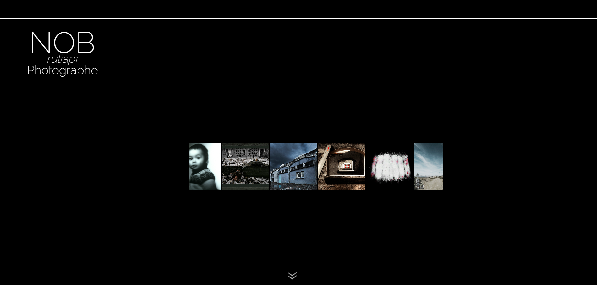
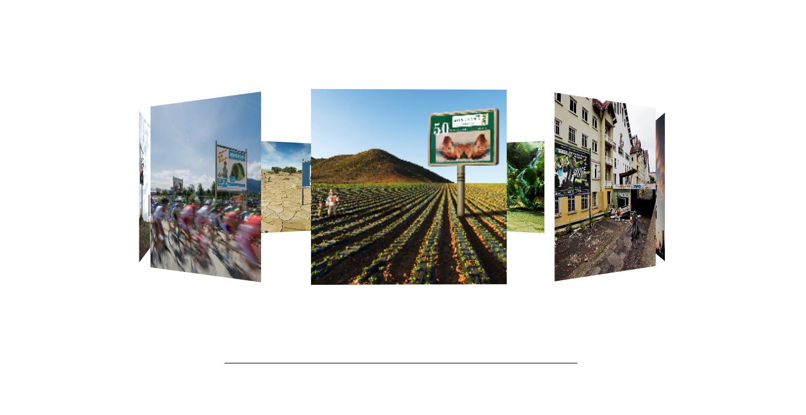
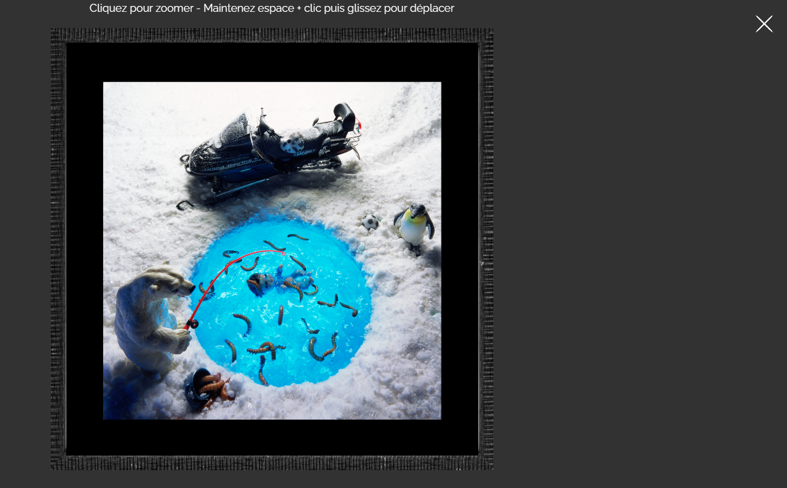
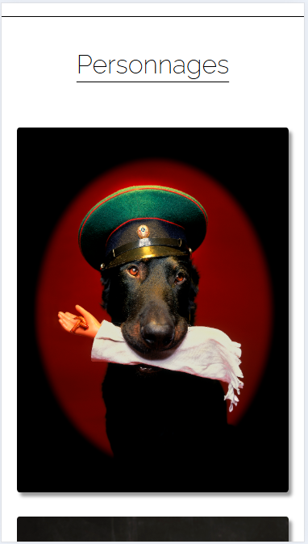

#  Site vitrine – Photographe

Site web développé pour un photographe professionnel à la retraite, mettant en valeur une rétrospective de son travail à travers une expérience visuelle immersive.

Demo : [nob-ruliapi-photographe.com](https://nob-ruliapi-photographe.vercel.app/)

---

##  Objectifs

- Mettre en valeur un portfolio photographique
- Créer une expérience utilisateur fluide et immersive
- Optimiser les performances (images, interactions)
- Proposer une navigation intuitive sur tous les supports

---

##  Stack technique

- **JavaScript (ES6 – Vanilla)**
- **HTML5**
- **CSS3** *(animations, responsive, effets visuels)*
- **Intersection Observer API**
- **Local optimizations (images, rendering)**

---

##  Fonctionnalités principales

###  Carrousels  dynamiques
- Implémentation de plusieurs types de carrousels selon les besoins UX :
  - Carrousel classique (navigation simple avec flèches)
  - Carrousel avec gestion des positions (active, left, right…)
  - Carrousel circulaire 3D et pause au survol
  - Slider horizontal infini 
- Gestion dynamique des états d’affichage
- Navigation fluide et boucle infinie
  
### Animations au scroll
- Apparition progressive des sections via Intersection Observer
- Déclenchement des animations en fonction du scroll
- Transitions fluides

###  Galeries interactives
- Affichage en grille avec effets visuels (blur / hover)
- Navigation fluide entre les sections

###  Mode plein écran avancé
- Ouverture des images en fullscreen
- Zoom interactif (clic)
- Déplacement de l’image (drag + espace)
- Fermeture via bouton ou touche `ESC`

###  Responsive design
- Mobile / tablette / desktop
- Adaptation des interactions (ex: désactivation du hint mobile)

###  Optimisation des performances
- Lazy loading des images
- Dimensionnement adapté
- Réduction du coût de rendu
  
---

##  Logique technique

- Manipulation dynamique du DOM (création d’éléments fullscreen)
- Gestion d’état UI :
  - zoom level
  - drag state
  - fullscreen state
- Event handling avancé :
  - `click`, `mousemove`, `keydown`
- Séparation des comportements :
  - slider
  - fullscreen
  - scroll animations

---

##  Installation

1. Cloner le projet :

```bash
git clone https://github.com/EnnioPilia/Nob-site.git
cd Nob-site
```

2. Ouvrir le projet avec un serveur local (ex : Live Server) :
   
```bash
index.html 
```

---

##  Aperçu

###  Page d’accueil
<p align="start">
  
</p>

###  Carrousel 3D
<p align="start">
  
</p>

###  Mode plein écran
<p align="start">
  
</p>

###  Mobile
<p align="start">
  
</p>

---

##  Améliorations possibles
- Ajout d’un backend (gestion des galeries)
- CMS pour édition du contenu
- Optimisation mobile des interactions (touch gestures)
- Préchargement intelligent des images

  ---

## Auteur

PILIA Ennio Développeur Fullstack


